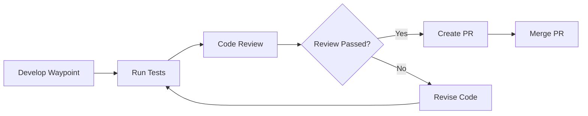

# GitHub Integration Guide

This guide covers the GitHub integration features in AIMA CodeGen, including automated pull request creation, code review workflows, and branch management.

## Table of Contents
- [Overview](#overview)
- [Prerequisites](#prerequisites)
- [Initial Setup](#initial-setup)
- [Configuration Options](#configuration-options)
- [Workflow Integration](#workflow-integration)
- [Reviewer Agent Features](#reviewer-agent-features)
- [Git Operations](#git-operations)
- [Pull Request Management](#pull-request-management)
- [Troubleshooting](#troubleshooting)
- [Best Practices](#best-practices)

## Overview

AIMA CodeGen's GitHub integration provides:
- **Automated PR Creation**: Each waypoint can create its own pull request
- **AI-Powered Code Review**: The Reviewer agent analyzes code before merging
- **Branch Management**: Automatic branch creation and switching
- **PR Lifecycle Management**: From creation to merge
- **Review Comments**: AI-generated insights posted directly to PRs

## Prerequisites

Before using GitHub integration, ensure you have:

1. **Git Installed**: Version 2.0 or higher
   ```bash
   git --version
   ```

2. **GitHub Account**: With repository access

3. **Personal Access Token**: With required permissions
   - Go to: https://github.com/settings/tokens
   - Click "Generate new token (classic)"
   - Select scopes:
     - `repo` (Full control of private repositories)
     - `workflow` (Update GitHub Action workflows)
   - Copy the generated token

4. **GitHub CLI (Optional)**: For enhanced features
   ```bash
   # Install GitHub CLI (macOS)
   brew install gh
   
   # Verify installation
   gh --version
   ```

## Initial Setup

### 1. Configure GitHub Token

#### Via CLI:
```bash
aima-codegen config --set GitHub.token --value YOUR_GITHUB_TOKEN
```

#### Via GUI:
1. Open the GUI: `aima-codegen gui`
2. Go to **Tools → GitHub Settings**
3. Enter your Personal Access Token
4. Click **Test Connection**
5. Save settings

#### Via Environment Variable:
```bash
export GITHUB_TOKEN=YOUR_GITHUB_TOKEN
```

### 2. Initialize Git Repository

For new projects, AIMA CodeGen can initialize Git:

```python
# This happens automatically when creating a project
# Or manually in your project directory:
git init
git remote add origin https://github.com/USERNAME/REPO.git
```

### 3. Configure Automation Settings

```bash
# Enable automatic PR creation
aima-codegen config --set GitHub.auto_pr --value true

# Enable automatic merging of approved PRs
aima-codegen config --set GitHub.auto_merge --value true
```

## Configuration Options

### Config File Settings

In `~/.AIMA_CodeGen/config.ini`:

```ini
[GitHub]
# GitHub Personal Access Token
token = ghp_xxxxxxxxxxxxxxxxxxxx

# Automatically create PRs after waypoint completion
auto_pr = true

# Automatically merge PRs that pass review
auto_merge = false

# Webhook URL for PR events (optional)
webhook_url = https://your-webhook-endpoint.com
```

### Per-Project Settings

Each project can override global settings:

```python
# In project_state.json
{
  "github_settings": {
    "auto_pr": true,
    "auto_merge": false,
    "default_branch": "main",
    "pr_prefix": "feat",
    "require_reviews": 1
  }
}
```

## Workflow Integration

### 1. Standard Development Flow



### 2. Automated PR Creation

When `auto_pr` is enabled:

1. **Waypoint Completion**: After successful tests
2. **Branch Creation**: `feature/waypoint-{id}`
3. **Commit Changes**: With descriptive message
4. **Push Branch**: To remote repository
5. **Create PR**: With AI-generated description

### 3. Manual PR Creation

Via the Reviewer agent:

```python
# In code
reviewer = ReviewerAgent(llm_service, github_token)
result = reviewer.execute({
    "action": "create_pr",
    "project_path": "/path/to/project",
    "branch_name": "feature/new-feature",
    "pr_title": "Add new feature",
    "pr_body": "Description of changes"
})
```

## Reviewer Agent Features

### Code Review Process

The Reviewer agent performs:

1. **Static Analysis**
   - Syntax checking
   - Code style compliance
   - Best practices verification

2. **Security Review**
   - Vulnerability scanning
   - Dependency checking
   - Secret detection

3. **Performance Analysis**
   - Complexity assessment
   - Resource usage
   - Optimization opportunities

4. **Test Coverage**
   - Missing test cases
   - Edge case handling
   - Integration test needs

### Review Output Format

```json
{
  "approved": false,
  "comments": [
    {
      "file": "src/calculator.py",
      "line": 23,
      "issue": "Potential division by zero",
      "severity": "high",
      "suggestion": "Add zero check before division"
    }
  ],
  "suggestions": [
    "Consider using type hints",
    "Add docstrings to public methods"
  ],
  "security_concerns": [
    "User input not validated"
  ]
}
```

### Integration with GitHub

Review results are:
- Posted as PR comments
- Added to PR description
- Used for merge decisions
- Tracked in project history

## Git Operations

### Local Git Management

The `GitOperations` class provides:

```python
# Initialize repository
GitOperations.init_repo(project_path)

# Create and switch branch
GitOperations.create_branch(project_path, "feature/new-feature")

# Commit changes
GitOperations.commit_changes(
    project_path,
    "feat: add new feature",
    files=["src/feature.py", "tests/test_feature.py"]
)

# Push to remote
GitOperations.push_branch(project_path, "feature/new-feature")
```

### Branch Naming Convention

Default pattern: `feature/{waypoint-id}`

Customizable via configuration:
- `feat/` - New features
- `fix/` - Bug fixes
- `docs/` - Documentation
- `refactor/` - Code refactoring
- `test/` - Test additions

## Pull Request Management

### Creating Pull Requests

#### Automatic Creation
Triggered by waypoint completion when `auto_pr=true`

#### Manual Creation via GUI
1. Complete development
2. Click **Create PR** in Code Review section
3. Review and edit PR details
4. Submit PR

#### Programmatic Creation
```python
github = GitHubIntegration(token)
result = github.create_pull_request(
    repo="username/repository",
    title="Feature: Add calculator",
    body="Implements basic calculator with tests",
    head="feature/calculator",
    base="main"
)
```

### PR Description Template

AIMA CodeGen generates PR descriptions with:

```markdown
## Waypoint: {waypoint_id}

**Description:** {waypoint_description}

### Changes Made
- List of files modified
- Key functionality added
- Tests included

### AI Review Summary
{review_summary}

### Checklist
- [x] Code follows style guidelines
- [x] Tests pass locally
- [x] Security review completed
- [x] Documentation updated

---
*Generated by AIMA CodeGen*
```

### Managing Pull Requests

#### Get PR Status
```python
pr_info = github.get_pull_request(repo, pr_number)
status = pr_info["state"]  # "open", "closed", "merged"
```

#### Add Comments
```python
github.create_issue_comment(
    repo="username/repository",
    issue_number=pr_number,
    body="AI Review: Found 2 minor issues"
)
```

#### Merge PR
```python
result = github.merge_pull_request(
    repo="username/repository",
    pr_number=42,
    merge_method="squash"  # or "merge", "rebase"
)
```

## Troubleshooting

### Common Issues

#### 1. Authentication Failures
```
Error: Bad credentials
```
**Solution**: 
- Verify token is valid
- Check token permissions
- Ensure token hasn't expired

#### 2. Push Failures
```
Error: failed to push some refs
```
**Solution**:
- Pull latest changes: `git pull origin main`
- Resolve conflicts if any
- Ensure you have push permissions

#### 3. PR Creation Fails
```
Error: Validation Failed
```
**Solution**:
- Check if PR already exists
- Verify branch names are valid
- Ensure base branch exists

#### 4. GitHub CLI Not Found
```
Error: gh command not found
```
**Solution**:
- Install GitHub CLI
- Or rely on API-only features
- Check PATH environment variable

### Debug Mode

Enable detailed logging:
```bash
aima-codegen config --set Logging.console_level --value DEBUG
```

Check logs at:
- `~/.AIMA_CodeGen/logs/app.log`
- `~/.AIMA_CodeGen/projects/{project}/logs/github.log`

## Best Practices

### 1. Security

- **Never commit tokens**: Use environment variables
- **Rotate tokens regularly**: Every 90 days
- **Limit token scope**: Only required permissions
- **Use SSH keys**: For enhanced security

### 2. Workflow

- **Small PRs**: One waypoint per PR
- **Descriptive titles**: Clear and concise
- **Complete reviews**: Address all comments
- **Clean history**: Squash commits when merging

### 3. Automation

- **Start manual**: Test workflow first
- **Enable gradually**: One feature at a time
- **Monitor results**: Check PR quality
- **Adjust settings**: Based on team needs

### 4. Team Collaboration

- **Branch protection**: Require reviews
- **Status checks**: Enforce CI/CD
- **Code owners**: Define review requirements
- **Templates**: Standardize PR format

### 5. Integration Tips

- **CI/CD Integration**: Trigger builds on PR
- **Slack notifications**: PR updates
- **Issue linking**: Connect to tickets
- **Milestone tracking**: Group related PRs

## Advanced Features

### Webhook Integration

Configure webhooks for real-time updates:

```python
# Setup webhook endpoint
result = github.setup_webhook(
    repo="username/repository",
    url="https://your-app.com/webhook",
    events=["pull_request", "pull_request_review"]
)
```

### Custom Review Rules

Define project-specific review criteria:

```python
# In project configuration
{
  "review_rules": {
    "require_tests": true,
    "min_test_coverage": 80,
    "max_complexity": 10,
    "forbidden_patterns": ["console.log", "debugger"],
    "required_files": ["README.md", "tests/"]
  }
}
```

### Batch Operations

Process multiple waypoints:

```python
# Create PRs for all completed waypoints
for waypoint in completed_waypoints:
    reviewer.execute({
        "action": "create_pr",
        "waypoint": waypoint,
        "batch_mode": true
    })
```

### Integration with GitHub Actions

Trigger workflows on PR events:

```yaml
# .github/workflows/aima-codegen.yml
name: AIMA CodeGen Integration
on:
  pull_request:
    types: [opened, synchronize]
    
jobs:
  ai-review:
    runs-on: ubuntu-latest
    steps:
      - uses: actions/checkout@v2
      - name: Run AI Review
        run: |
          aima-codegen review --pr ${{ github.event.number }}
```

## Example Workflows

### 1. Feature Development
```bash
# Initialize project
aima-codegen init "My Feature" --budget 10

# Develop with GitHub integration
aima-codegen develop --prompt "Create user authentication"

# Automatic: PR created, reviewed, and ready
```

### 2. Bug Fix Workflow
```bash
# Load project
aima-codegen load "My Project"

# Fix specific issue
aima-codegen develop --prompt "Fix login validation bug"

# Manual review and PR
aima-codegen review --create-pr
```

### 3. Documentation Update
```bash
# Quick docs update
aima-codegen develop --prompt "Update API documentation"

# Skip review for docs
aima-codegen config --set GitHub.skip_review_for_docs --value true
```

## Conclusion

GitHub integration in AIMA CodeGen streamlines the development workflow by:
- Automating repetitive tasks
- Ensuring code quality through AI review
- Maintaining clean Git history
- Facilitating team collaboration

For more information, see the main documentation or visit the GitHub repository.